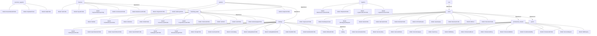

# django_python
Hybrid Marketplace

## Architecture Flow Chart

```mermaid
graph TD
    classDef appStyle fill:#f9f,stroke:#333,stroke-width:2px;
    classDef modelStyle fill:#bbf,stroke:#333,stroke-width:1px;
    catalogs -->|depends on| catalog
    finances -->|depends on| marketing_leads
    marketing_leads -->|depends on| catalogs
    systems -->|depends on| marketing_leads
    systems -->|depends on| catalogs
    users -->|depends on| guests
    users -->|depends on| professional_network
    core -->|depends on| users
    catalogs --- AttributeProfile[Model: AttributeProfile]
    catalogs --- BundlesKitsProfile[Model: BundlesKitsProfile]
    catalogs --- BundleProfile[Model: BundleProfile]
    catalogs --- CatalogMediaProfile[Model: CatalogMediaProfile]
    catalogs --- CatalogMediaProfile[Model: CatalogMediaProfile]
    catalogs --- CatalogStatusProfile[Model: CatalogStatusProfile]
    catalogs --- CatalogStatusProfile[Model: CatalogStatusProfile]
    catalogs --- CoreCatalog[Model: CoreCatalog]
    catalogs --- InventoryProfile[Model: InventoryProfile]
    catalogs --- PricingProfile[Model: PricingProfile]
    catalogs --- ReviewsRatingsProfile[Model: ReviewsRatingsProfile]
    catalogs --- CatalogReviewProfile[Model: CatalogReviewProfile]
    catalogs --- SearchFilterProfile[Model: SearchFilterProfile]
    catalogs --- SearchFiltersProfile[Model: SearchFiltersProfile]
    catalogs --- SpecificationsProfile[Model: SpecificationsProfile]
    catalogs --- CatalogVariantProfile[Model: CatalogVariantProfile]
    customer_supports --- FAQProfile[Model: FAQProfile]
    customer_supports --- HelpdeskTicket[Model: HelpdeskTicket]
    customer_supports --- ReturnRefundProfile[Model: ReturnRefundProfile]
    finances --- BankAccountProfile[Model: BankAccountProfile]
    finances --- CommissionProfile[Model: CommissionProfile]
    finances --- PaymentGatewayConfig[Model: PaymentGatewayConfig]
    finances --- PayoutProfile[Model: PayoutProfile]
    finances --- TaxProfile[Model: TaxProfile]
    logistics --- LogisticsPartnerProfile[Model: LogisticsPartnerProfile]
    logistics --- LogisticsReturnProfile[Model: LogisticsReturnProfile]
    logistics --- ShipmentProfile[Model: ShipmentProfile]
    logistics --- WarehouseTransferProfile[Model: WarehouseTransferProfile]
    marketing_leads --- AdsCampaignProfile[Model: AdsCampaignProfile]
    marketing_leads --- CartProfile[Model: CartProfile]
    marketing_leads --- CartItem[Model: CartItem]
    marketing_leads --- CheckoutProfile[Model: CheckoutProfile]
    marketing_leads --- CouponDiscountProfile[Model: CouponDiscountProfile]
    marketing_leads --- CustomerLeadProfile[Model: CustomerLeadProfile]
    marketing_leads --- OrderProfile[Model: OrderProfile]
    marketing_leads --- OrderItem[Model: OrderItem]
    marketing_leads --- PushNotificationProfile[Model: PushNotificationProfile]
    marketing_leads --- Wishlist[Model: Wishlist]
    professional_network --- SkillEnquiry[Model: SkillEnquiry]
    professional_network --- ProfessionalProfile[Model: ProfessionalProfile]
    professional_network --- ServiceRequest[Model: ServiceRequest]
    professional_network --- ProviderAvailability[Model: ProviderAvailability]
    professional_network --- ProfessionalProfile[Model: ProfessionalProfile]
    professional_network --- ProfessionalMedia[Model: ProfessionalMedia]
    professional_network --- ProfessionalStory[Model: ProfessionalStory]
    professional_network --- ProfessionalEvent[Model: ProfessionalEvent]
    professional_network --- SkillRating[Model: SkillRating]
    professional_network --- SearchLog[Model: SearchLog]
    professional_network --- ServiceCategory[Model: ServiceCategory]
    professional_network --- ServiceAttribute[Model: ServiceAttribute]
    professional_network --- ServiceListing[Model: ServiceListing]
    professional_network --- ServiceVariationPlan[Model: ServiceVariationPlan]
    systems --- AnalyticsProfile[Model: AnalyticsProfile]
    systems --- AuditLogProfile[Model: AuditLogProfile]
    systems --- IntegrationProfile[Model: IntegrationProfile]
    users --- ExecutiveProfile[Model: ExecutiveProfile]
    users --- Address[Model: Address]
    users --- BusinessProfile[Model: BusinessProfile]
    users --- GuestInquiry[Model: GuestInquiry]
    users --- OTPVerification[Model: OTPVerification]
    users --- MemberProfile[Model: MemberProfile]
    users --- MerchantProfile[Model: MerchantProfile]
    users --- SellerProfile[Model: SellerProfile]
    users --- RoleUpgradeRequest[Model: RoleUpgradeRequest]
    users --- RoleRequirement[Model: RoleRequirement]
    users --- SuperuserProfile[Model: SuperuserProfile]
```
